<div align="center">

# 👨‍💻 SATHISH KRISHNAMOORTHI


</div>

## 🎯 Why Hire Me?

<div align="center">

**I transform complex AI research into production-ready systems that deliver measurable business value.**

| 💡 Innovation | 🚀 Execution | 📈 Results |
|:---:|:---:|:---:|
| LLM-powered solutions | Production-grade APIs | Scalable AI systems |
| RAG architectures | End-to-end deployment | Performance optimization |
| Document intelligence | Docker containerization | Real-world impact |

</div>

## 🛠️ Technical Arsenal

<div align="center">

### AI & Machine Learning


### LLM & NLP Stack
<p>


</p>

### Development & Deployment


### Tools & Frameworks


</div>

## 🏗️ Core Expertise: RAG Pipeline Architecture

```mermaid
graph TD
    A[📄 Documents/Videos/Text] --> B[🔄 Preprocessing]
    B --> C[🧮 Embeddings Generation]
    C --> D[💾 Vector Database]
    D --> E[🔍 Semantic Search]
    E --> F[🤖 LLM Context Injection]
    F --> G[✨ Grounded Answers]
    
    style A fill:#e1f5ff
    style G fill:#d4edda
    style F fill:#fff3cd
```

<div align="center">



**The Complete AI Stack I Deploy:**
- **Ingestion:** Multi-format document processing (PDF, DOCX, TXT, Video)
- **Embedding:** OpenAI, Sentence Transformers, Custom fine-tuned models
- **Storage:** FAISS, ChromaDB, Pinecone for vector search
- **Retrieval:** Hybrid search, re-ranking, contextual compression
- **Generation:** GPT-4, Claude, Llama 2/3, Mistral
- **Deployment:** FastAPI + Docker + CI/CD pipelines

</div>

## 🚀 Production-Ready AI Systems

<div align="center">

| Project | Technology | Impact |
|---------|-----------|--------|
| 📚 **DocuMind** | RAG + LangChain + FAISS | Intelligent document Q&A system |
| 💼 **CareerGPT** | NLP + Custom Models | AI-powered career guidance |
| 📄 **ATS ResumeAI** | Document Intelligence | Resume optimization engine |
| 🎥 **YouTubeRAG** | Video Transcription + RAG | Video content search & summarization |
| ✍️ **ContentAI** | LLM Fine-tuning | Automated content generation |

</div>

## 💪 What Sets Me Apart

<div align="center">

<table>
<tr>
<td align="center" width="33%">

### 🎯 Research → Production
I don't just build prototypes. I ship **scalable, production-grade AI systems** with proper monitoring, error handling, and performance optimization.

</td>
<td align="center" width="33%">

### ⚡ Performance Focus
Obsessed with **latency reduction**, **accuracy improvement**, and **cost optimization**. Every millisecond and token matters.

</td>
<td align="center" width="33%">

### 🔧 Full-Stack AI
From **data preprocessing** to **model deployment** to **user-facing APIs**. I handle the entire AI pipeline.

</td>
</tr>
</table>

</div>

## 📊 GitHub Activity

<div align="center">


</div>

## 🎓 Continuous Learning

<div align="center">

```python
class AIEngineer:
    def __init__(self):
        self.name = "Sathish Krishnamoorthi"
        self.role = "AI/LLM/RAG Engineer"
        self.focus = ["LLMs", "RAG", "NLP", "Document AI"]
        
    def daily_routine(self):
        return [
            "🔬 Research latest LLM papers",
            "⚙️ Optimize RAG pipelines",
            "🚀 Deploy production models",
            "📊 Monitor system performance",
            "🧪 Experiment with new architectures"
        ]
    
    def value_proposition(self):
        return "Transforming AI research into business impact"
```

</div>

## 📫 Let's Connect

<div align="center">

<a href="mailto:sathishkrishnamoorthi.contact@gmail.com">

</a>
<a href="https://linkedin.com/in/sathishkrishnamoorthi-lnkin">

</a>
<a href="https://github.com/sathishk">

</a>

<br/>
<br/>

### 💼 Open to Opportunities

**Looking for:** AI/LLM Engineer, RAG Specialist, NLP Engineer roles  
**Location:** Remote / Hybrid  
**Availability:** Immediate

---


**⭐ If you find my work valuable, consider starring my repositories!**

</div>

---

<div align="center">
<sub>Built with 💙 using AI, passion, and lots of coffee ☕</sub>
</div>
